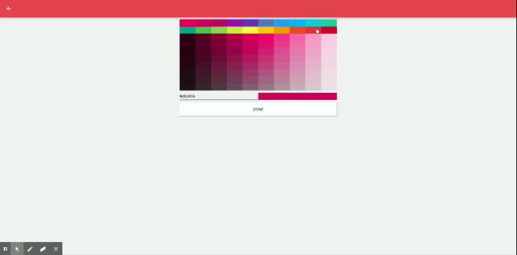

# croma-color-picker

Simple and intuitive color picker for react native




### Installation

`npm install --save croma-color-picker`

### Example

https://github.com/croma-app/croma-react/blob/master/screens/ColorPickerScreen.js

### Publish

Change version in package.json and run
`npm publish`

### web

Used in https://croma.app

### Android

Playstore: https://play.google.com/store/apps/details?id=app.croma

### Local testing

Add following(With relative local path) to your package.json in any react native project or use [Croma](https://github.com/croma-app/croma)

``` "croma-color-picker": "file:../croma-color-picker" ```
